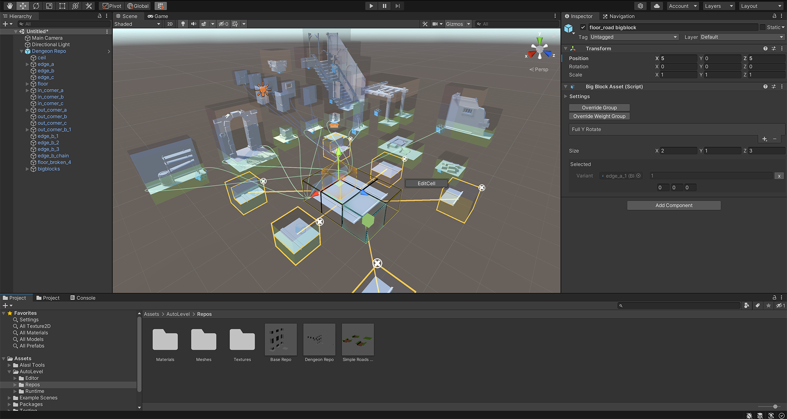

# Auto-Level

[](https://www.youtube.com/watch?v=94toUiUJqB8 "Autolevel Trailer")

Free procural level generator based on WFC algorithm for unity.

The target of this package is to create a procural level generator that is controllable, easy to use, and fast to some extent by leveraging the power of the WFC.

## Features
* Weight, volume, and boundary constraints
* Editor tools to easily configure your art and constraint the builder
* Easily extended
* Selection rebuild
* Big block support
* Fbx export
* Multi-threaded solver (only work with constraints)

Complete C# source code is provided.

## Usage

Clone the repo with submodules using the following command:
```
git clone --recurse-submodules https://github.com/Al-Asl/AutoLevel.git
```
Auto level consists of the following components:

* `Level Builder` where you can do all of your constraints, building, and exporting.


* `Block Repo` is the resource needed by the `Level Builder` to run, it basically contains the pieces and the relationship between them.


* `Block Asset` is the main component needed to define the relationships between pieces.
* `Big Block Asset` is a composite of blocks generated by `Block Asset` used on blocks that need to be transformed together.

You can get started by watching the [tutorial](https://www.youtube.com/watch?v=1-M3W0y42L4).

you can also check the API usage to build the level at runtime check out the `Example Scenes\Runtime`

**FILLING**

When selecting a `Block Asset,` there is an option called filling in the scene view context menu dropdown. This will show handles to edit the block filling, red for empty and green for fill, similar to the marching cubes algorithm.

`Level Builder` can use that information to define the level rooms. The builder contains two built-in groups, the 'Empty' and 'Solid' groups, and you can use them to define the rooms and walls.

## PERFORMANCE TIPS

* Keep in mind that the Building performance depends on two factors the size of the builder and the number of blocks produced by the repo. You can get better performance by only building where needed using multiple builders. Also, using constraints can reduce the building time significantly.
* Multi-threaded solver can only give a better performance where constraints are used with a heavy load task and could yield up to 3x the original performance.

## WHATS NEXT
* Layers
* Fine Block connection control