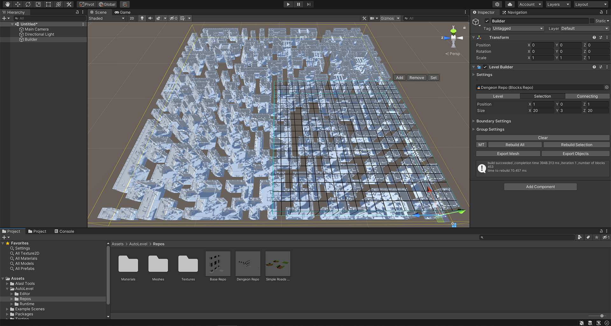

# Auto-Level


Free procural level generator based on WFC algorithm for unity.

The target of this package is to create a procural level generator that is controllable, easy to use, and fast to some extent by leveraging the power of the WFC. WFC is a powerful algorithm in terms of procural generation. However, it does not give the user control over the generation process.

## Features
* Runtime WFC solver
* Editor tools, build level inside the editor
* Set the weight for individual tiles or tiles group
* Control the generation process, constrain volume to groups of tiles
* Ability to rebuild a small section of the level
* Tile variants and tiles group variants
* Mesh builder that supports multiable materials input, with the ability to subdivide the level into chunks
* fbx export

Complete C# source code is provided.

## Usage

* Create the `Blocks Repo` by clicking 'GameObject/AutoLevel/Blocks Repo'
* Place tiles under the `Blocks Repo` in the hierarchy. Make sure that the mesh is read/write enabled in the import settings, and the tiles are in the range (0,0,0) (1,1,1)
* Add the `Block Asset` component to the tiles
* Select a tile and start making connections in the scene view. Remember to change the editing mode to connection. After the connections are made, the `Blocks Repo` is ready to use


* Create a `Level Builder` by clicking 'GameObject/AutoLevel/Builder'
* Assign the `Blocks Repo` to the builder
* Use the selection handle to set block groups over the level. The level inspector provides a toggle to switch between controlling the level or selection bounds. Bounds can be controlled via inspector or by using scene handles. toggle between the different handles using w,r,t
* Hit the rebuild button
* Hit export to export the result to fbx file



### Runtime Example

```csharp
public class RuntimeExample : MonoBehaviour
{
    [SerializeField]
    public BlocksRepo repo;
    [SerializeField]
    public BoundsInt bounds;

    private LevelData levelData;
    private LevelMeshBuilder meshBuilder;
    private LevelSolver solver;

    private void OnEnable()
    {
        //generate blocks connections, variants and other configuration
        repo.Generate();

        //a container for the solver result
        levelData = new LevelData(bounds);
        meshBuilder = new LevelMeshBuilder(levelData,repo);

        solver = new LevelSolver(bounds.size);
        solver.repo = repo;
        solver.levelData = levelData;
    }

    private void OnDisable()
    {
        repo.Clear();
        meshBuilder.Dispose();
    }

    private void Update()
    {
        if (Input.GetKeyDown(KeyCode.R))
            Rebuild();
    }

    void Rebuild()
    {
        //solve the level, this will return the number of iteration it took,
        //0 means the solver has failed
        var iterations = solver.Solve(bounds);
        if (iterations > 0)
        {
            //rebuild the mesh if the solver success
            meshBuilder.Rebuild(bounds);
        }
    }
}
```

**FILLING**

When selecting a `Block Asset,` there is an option called filling in the scene view context menu dropdown. This will show handles to edit the block filling, red for empty and green for fill, similar to the marching cubes algorithm.

The filling comes into play in two parts. First, the connections will only be made to blocks with similar side patterns. Second, `Level Builder` can use that information to define the level rooms. The builder contains two built-in groups, the 'Empty' and 'Solid' groups, and you can use them to define the rooms and walls.

## PERFORMACE

* Regarding the memory, reducing the memory usage can be done by switching to dictionary instead of arrays. This also helped with performance. The old implementation processing time goes exponentially with the number of tiles. Now it's linear.
* There is a considerable cost when using tile group. This cost has been reduced significantly by creating a lookup table for group interaction.
* Using the `Level Builder` for a huge level is limited. That's because of the serialization cost to support `Undo` and saving changes to disk, next update there will be an option to ignore serialization.

## WHAT NEXT
* Fine tile connection control
* Big tile support
* Multithredead solving
* Fast editing mode
* Export for the tiles GameObject
* More constrain